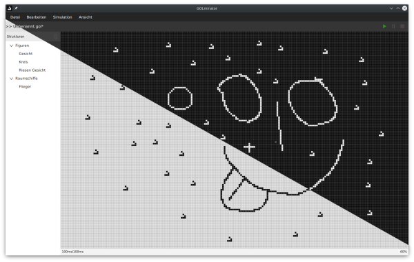

# GOLminator

An editor for [Conway's Game of Life](https://en.wikipedia.org/wiki/Conway's_Game_of_Life).



## Features

- infinite grid
- mouse selection
- move selection with mouse
- copy, cut, paste
- variable simulation speed
- multithreading
- load/save worlds
- load/save structures
- light and dark theme

## Building

Clone the repo and open the directory in [IntelliJ IDEA](https://www.jetbrains.com/idea/).
```sh
git clone https://github.com/Bananenpro/golminator.git
```

1. Open `Add Configuration...` -> `+` -> `Maven`
2. Paste `javafx:run -f pom.xml` into the input box labeled `Run`
3. Hit `Modify options` -> `Add before launch task` -> `Run Maven Goal`
4. Paste `compiler:compile` into the `Command line` field and hit `OK`
5. Hit `OK`
6. Click on the green arrow button to run the project


## License

This program is free software: you can redistribute it and/or modify
it under the terms of the GNU General Public License as published by
the Free Software Foundation, either version 3 of the License, or
(at your option) any later version.

This program is distributed in the hope that it will be useful,
but WITHOUT ANY WARRANTY; without even the implied warranty of
MERCHANTABILITY or FITNESS FOR A PARTICULAR PURPOSE.  See the
GNU General Public License for more details.

You should have received a copy of the GNU General Public License
along with this program.  If not, see <http://www.gnu.org/licenses/>.

## Copyright

Copyright © 2021-2022 Julian Hofmann
